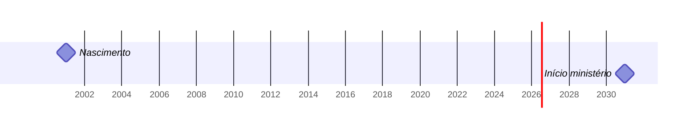

---
toc:
  depth_from: 2
  depth_to: 2
  ordered: false
---

# A Bíblia por ela Mesma
___

[TOC]

## Prefácio

Neste projeto de estudo da Bíblia o mínimo de fontes externas é utilizado. Interpretações e referências são literais, concretas e encontram referência dentro da própria Palavra de Deus. As únicas definições que não são extraídas da própria Palavra de Deus são as traduções e as localizações geográficas.

A fim de evitar diferentes viéses as fontes utilizadas são somente:
- Bíblia, Nova Versão Internacional (NVI) [^nvi];
- Concordância Strong [^strong];

Creio que da Palavra de Deus podem ser extraídas revelações pessoais e voltadas para tempos específicos. Creio que Ela possui textos literais e metafóricos. Tento com isso reduzir os riscos de incorrer interpretações hereges, mas mesmo sim produzir conteúdo que favoreça o estudo, a reflexão e ajudar eu e outras pessoas a receberem interpretações pessoais e temporais por meio do Espírito Santo de Deus.

## Gênesis

### 1

^1^ No princípio Deus criou os céus e a terra.

^2^ Era a terra sem forma e vazia; trevas cobriam a face do abismo, e o Espírito de Deus se movia sobre a face das águas.

## João

### 1

^1^ No princípio era aquele que é a Palavra. Ele estava com Deus e era Deus. ^2^ Ele estava com Deus no princípio.

^3^ Todas as coisas foram feitas por intermédio dele; sem ele, nada do que existe teria sido feito. ^4^ Nele estava a vida, e esta era a luz dos homens. ^5^ A luz brilha nas trevas, e as trevas não a derrotaram.

^6^ Surgiu um homem enviado por Deus, chamado João. ^7^ Ele veio como testemunha, para testificar acerca da luz, a fim de que por meio dele todos os homens cressem. ^8^ Ele próprio não era a luz, mas veio como testemunha da luz. ^9^ Estava chegando ao mundo a verdadeira luz, que ilumina todos os homens.

^10^ Aquele que é a Palavra estava no mundo, e o mundo foi feito por intermédio dele, mas o mundo não o reconheceu. ^11^ Veio para o que era seu, mas os seus não o receberam. ^12^ Contudo, aos que o receberam, aos que creram em seu nome, deu-lhes o direito de se tornarem filhos de Deus,

## Lucas

### 3

^21^ Quando todo o povo estava sendo batizado, também Jesus o foi. E, enquanto ele estava orando, o céu se abriu ^22^ e o Espírito Santo desceu sobre ele em forma corpórea, como pomba. Então veio do céu uma voz: “Tu és o meu Filho amado; em ti me agrado”.

^23^ Jesus tinha cerca de trinta anos de idade quando começou seu ministério. Ele era considerado filho de José,

filho de Eli,

___

## Fatos e Definições

### Nomes de Deus

*[Deus]:
> - Aquele que criou os céus e a terra (Gn1.1)

*[Espírito de Deus]:
> - Ele se movia sobre a face das águas (Gn1.2)

*[Espírito Santo]:
> - Desceu sobre Jesus em forma corpórea, como pomba (Lc3.22)

*[Palavra]:
> - Aquele que era no princípio, estava com Deus e era Deus (Jo1.1)
> - Ele estava com Deus no princípio (Jo1.2)
> - Aquele pelo qual todas as coisas foram feitas e sem o qual nada do que existe teria sido feito (Jo1.3)
> - Nele estava a vida (Jo1.4)
> - O mundo foi feito por intermédio dele, mas o mundo não o reconheceu (Jo1.10)
> - Veio para o que era seu, mas os seus não o receberam (Jo1.11)

*[Verdadeira luz|verdadeira luz]:
> - Ilumina todos os homens (Jo1.9)

*[Jesus]:
> - Foi batizado quando todo o povo estava sendo (Lc3.21)
> - O ceu se abriu enquanto ele estava orando (Lc3.21)
> - Tinha cerca de trinta anos de idade quando começou seu ministério (Lc3.23)
> - Era considerado filho de José (Lc3.23)

*[Filho amado]:
> - Jesus é o Filho amado daquele cuja voz veio do céu (Lc3.22)
> - Aquele cuja voz veio do céu se agrada do Filho amado (Lc3.22)

### Pessoas

*[João]: Batista: homem enviado por Deus (Jo1.6); veio para que todos cressem por meio dele (Jo1.7); ele não era a luz (Jo1.8); mas veio para testificar acerca da luz (Jo1.7,8)

*[José]:
> - Filho de Eli (Lc3.23)
> - Considerado pai de Jesus (Lc3.23)

*[Eli]:
> - Pai de José (Lc3.23)

### Termos

*[No princípio|no princípio]: "tempo" no qual Deus criou os céus e a terra (Gn1.1); "tempo" em que era aquele que é a Palavra (Jo1.1)
*[abismo]: sua face era coberta por trevas (Gn1.2)
*[águas]: sobre sua face se movia o Espírito de Deus (Gn1.2)

*[Céu|céu]:
> - Se abriu enquanto Jesus estava orando (Lc3.21)
> - Veio do céu uma voz: “Tu és o meu Filho amado; em ti me agrado” (Lc3.22)

*[céus]: criado por Deus No princípio (Gn1.1)
*[luz]: brilha nas trevas (Jo1.5)
*[luz dos homens]: Era a vida que estava na Palavra (Jo1.4)

*[ministério]:
> - O de Jesus começou quando ele tinha cerca de trinta anos (Lc3.23)

*[mundo]: feito por intermédio daquele que é a Palavra e não reconheceu aquele que é a Palavra (Jo1.10)
*[terra]: criada por Deus No princípio (Gn1.1). era sem forma e vazia (Gn1.2)
*[trevas]: cobriam a face do abismo (Gn1.2)
*[vida]: luz dos homens (Jo1.4)

*[Pomba|pomba]:
> - Como pomba, o Espírito Santo desceu sobre Jesus em forma corpórea (Lc3.22)

*[Filhos de Deus|filhos de Deus]:
> - Receberam aquele que é a Palavra (Jo1.12)
> - Creram naquele que é a Palavra (Jo1.12)
> - Ganharam o direito de se tornarem filhos de Deus (Jo1.12)

### Genealogia

## Referências

[^nvi]: Nova Versão Internacional, <https://www.biblica.com/bible/nvi-pt/>

[^strong]: Concordância de Strong, <https://biblehub.com/kjvs/genesis/1.htm>
